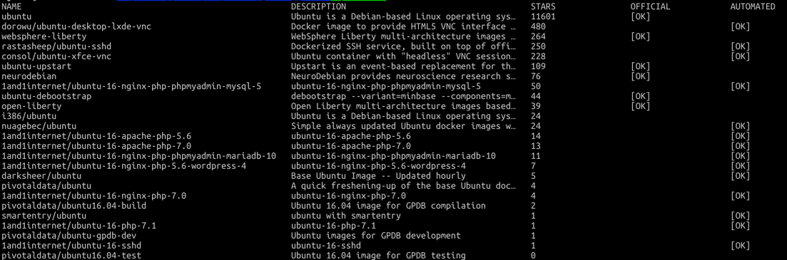

# docker image

이미지란, docker container 를 만들기 위한 iso file 이라 볼 수 있다.
예컨데, ubuntu image 를 이용해서 ubuntu OS 를 가진 container 를 만들 수 있다.

이러한 이미지는 기본적으로 docker 에서 제공하는 [docker hub](https://hub.docker.com) 에서 제공하고 있는데,
official 라벨이 없는 경우 제대로 동작하지 않을 수 있다.

그렇다고 private 한 docker hub 를 만든다면 repository 당 가격이 부과되기 때문에 부담스럽다.

- docker search ubuntu
  - 검색 결과 
    이와 같이 official tag 가 없는 것들이 있다.

## 이미지 생성

- docker run -it --name commit_test ubuntu:14.04
- ~ : echo test_first! >> first
- docker commit -a "alicek106" -m "my first commit" commit_test commit_test:first
  
  -> test_first! 라는 내용의 file `first` 가 생성되었고, 이를 commit_test:first 라고 명명하여 image 를 commit 한다.

쉽게 말해 image 도 구성 자체를 하나의 코드로 보고 github 에 올리듯 commit 을 통해 새로운 image 로 업로드 할 수 있다.

이는 open source 에 올린것이 아니기에 official 이 아니고 개인이 올린것이기에 그냥 올라간 것을 누구나 쓸 수 있게 되는 것이다.

- docker rmi -f -> 사용중인 image 의 경우 삭제가 불가능하니 -f 옵션으로 삭제가 가능하다. 다만 그럴 경우 <none> repository 에 <none> tag 로 남게된다.

이렇게 될 경우 그대로 남아 있기 때문에 docker image prune 을 다시 실행하거나, 연관 image, container 를 stop, remove 후 삭제해야 한다.

## 이미지 추출

이미지를 바이너리 파일 등 별도의 방법으로 저장하거나 욺기는 등의 작업을 할 때 쓰는 방법이다.

- docker save -o ubuntu_14_04.tar ubuntu:14.04 -> --name 과 동일한 옵션이 -o 이다. 다만 확장자까지 입력해서 추출하는 방식까지 정한다.
- docker load -i ubunut_14_04.tar -> save 의 반대격이다. tar 를 통해 (바이너리 파일을 통해) docker image 로 가져올 수 있다.

그러나 이와 같은 방식은 좋은 방법이 아니다. ~~그러니까 쓰지 말자~~ 그리고 save, load 와 비슷한 export, import 도 있는데, 옵션도 사용 방법도 동일하다.

- docker tag PREV_IMAGE_NAME NEXT_IMAGE_NAME -> PREV_IMAGE_NAME 을 NEXT_IMAGE_NAME 으로 바꾼다. 다만 version 또한 붙여야 한다.
